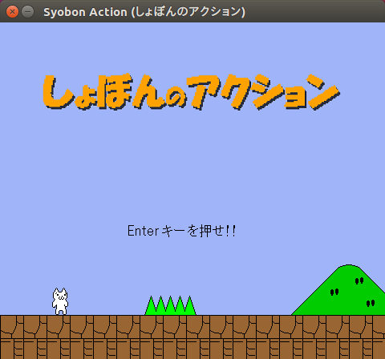

# Unofficial Snap Packaging for Open Syobon Action (オープンしょぼんのアクション)
<!--
	Use the Staticaly service for easy access to in-repo pictures:
	https://www.staticaly.com/
-->
 Icon of Open Syobon Action (オープンしょぼんのアクション)")

**This is the unofficial snap for [Open Syobon Action (オープンしょぼんのアクション)](https://github.com/angelXwind/OpenSyobonAction)**, *"An open-source cross-platform port of the unforgiving Japanese platformer"*. It works on Ubuntu, Fedora, Debian, and other major Linux distributions.

<!-- Uncomment and modify this when you are provided a build status badge

-->

Published for  with 💝 by Snapcrafters

<!-- Uncomment and modify this when you have published the snap to the Snap Store
## Installation
([Don't have snapd installed?](https://snapcraft.io/docs/core/install))

### In a Terminal
    # Install the snap #
    sudo snap install --channel=edge --devmode open-syobon-action
    #sudo snap install --channel=beta open-syobon-action
    #sudo snap install open-syobon-action

    # Connect the snap to optional security confinement interfaces #
    ## Allow the game to access your joysticks ##
    sudo snap connect open-syobon-action:joystick
    
    # Launch the game #
    open-syobon-action
    snap run open-syobon-action # If you have another existing installation

### The Graphical Way

-->

## What is Working
* Launch game
* Sound
* Killed
* Switch levels

## What is NOT Working...yet 
Check out the [issue tracker](https://github.com/Lin-Buo-Ren/OpenSyobonAction-snap/issues) for known issues.

## Support
* Report issues regarding using this snap to the issue tracker:  
  <https://github.com/Lin-Buo-Ren/OpenSyobonAction-snap/issues>
* You may also post on the Snapcraft Forum, under the `snap` topic category:  
  <https://forum.snapcraft.io/c/snap>
